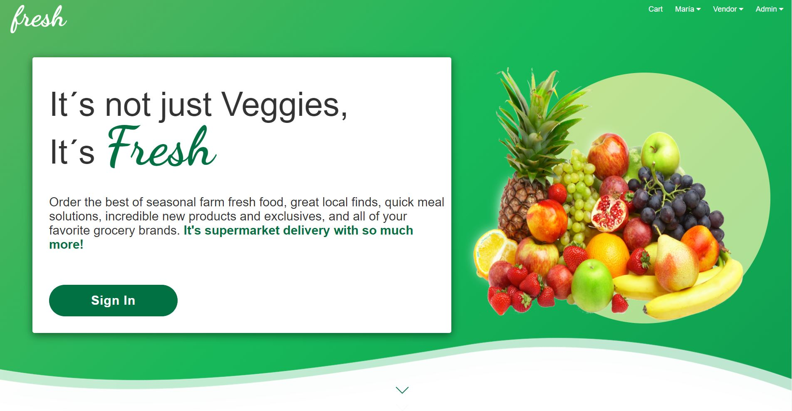

# fresh

### Description 🍍 

Marketplace Web-app. Order the best of seasonal farm fresh food, great local finds, quick meal solutions, incredible new products and exclusives, and all of your favorite grocery brands. It's supermarket delivery with so much more!

MERN application, built with React & Redux MongoDB, Express and Node.



## Start the app 🚀

Instructions to get a copy of the working project on your local machine for development and testing purposes.

### Requirements 📋

* Fork this repo.
* Clone this repo.

### BACKEND Installation 🔧

Install all dependencies described in package.json in the fresh-v3 folder:

```
$ npm install
```

Start the back at http://localhost:5000/

```
$ npm start
```

### FRONTEND Installation 🔧

Install all dependencies described in package.json in the /fresh-v3/frontend folder:

```
$ npm install
```

Start your REACT app at http://localhost:3000/

```
$ npm start
```


## DEMO 🍉

LIVE DEMO:

https://fresh-react-app.herokuapp.com/

## Built with 🛠️

* [MongoDB](https://www.mongodb.com/cloud/atlas) - Multi-cloud database service for MongoDB.
* [Express](https://expressjs.com/) - Backend web application framework for Node.js.
* [React](https://reactjs.org/) - Open source Javascript library designed to create user interfaces on a single page.
* [Redux](https://redux.js.org/) - A Predictable State Container for JS Apps.
* [NodeJS](https://nodejs.org/) - Node.js is a cross-platform runtime environment for the server layer based in JavaScript.
* [Mongoose](https://mongoosejs.com/) - MongoDB object modeling for node.js.
* [Axios](https://www.npmjs.com/package/axios) - Promise based HTTP client for the browser and node.js.
* [Bootstrap](https://getbootstrap.com/) - Front-end styles.
* [Heroku](https://www.heroku.com/) - For backend deployment.
* [PayPal](https://www.paypal.com/) - PayPal is a fast and safe money sending solution.
* [JWT](https://jwt.io/) - JSON Web Tokens are an open, industry standard RFC 7519 method for representing claims securely between two parties.

